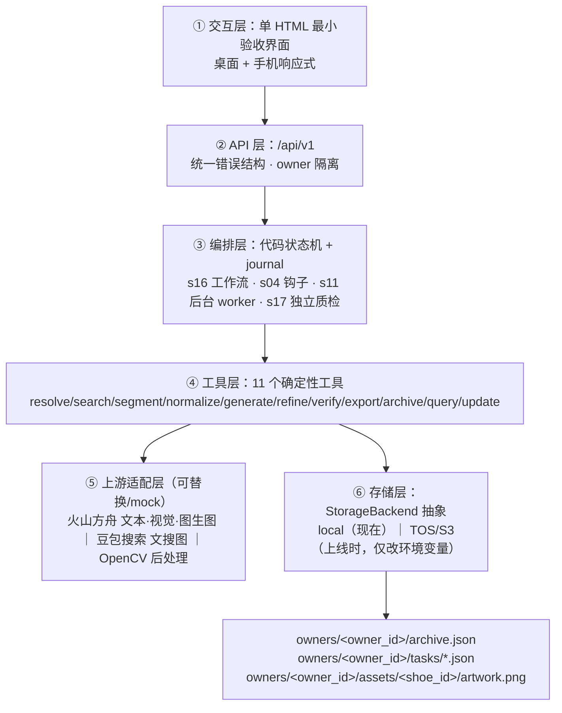

# 履历 · 球鞋线稿纪念档案（履 = 鞋，历 = 经历）

> 输入一款鞋的型号 → 取到这款鞋的图 → 转成固定风格的**黑白线稿** → 确认后归档进「我的鞋柜」。
> 一双鞋 = 人生履历上的一行。

`阶段 1 后端核心链路 完成` · `阶段 3 正式前端 完成` · `阶段 4 已上线（火山引擎 veFaaS + TOS + API 网关）` · `后端 236 项 + 前端 27 项测试全绿` · `真实模型 + 真实搜图 + 线上真实闭环跑通` · `单次调用量 –0.67` · `生成 14–34 秒`

---

## 线上体验（已部署）

**入口：<https://sf7d7f90oeokpqnk7mllk.apigateway-cn-beijing.volceapi.com/>** —— 需要邀请码（30 天有效、每个最多生成 20 双）。

| 设计点 | 线上怎么做的 |
| --- | --- |
| 登录 | 邀请码换取签名 Cookie 会话；**一码一鞋柜**（`owner_id` 由邀请码确定性派生，换设备也能回到自己的鞋柜） |
| 额度 | 一码 20 次生成；额度用完/过期后**已归档鞋柜仍可查看**；质检自动重试不额外扣额度 |
| 数据 | 全部存火山对象存储 TOS，按 `owners/{owner_id}/` 多租户隔离；不依赖实例本地磁盘 |
| 成本取舍 | 函数**最大实例数 1、不开预留实例**（保证计数与档案不冲突、极致省钱；代价是冷启动，有中断恢复兜底） |

完整上线过程、踩到的坑与修复（3 个真实缺陷）见 [`docs/早期上线记录.md`](docs/早期上线记录.md)；交付给使用者的自检步骤见 [`docs/本机验收清单.md`](docs/本机验收清单.md)。

上线后验收脚本（只用真实 HTTP，凭据走环境变量）：

```bash
# 鉴权与多租户隔离（26 项）
export LVLI_BASE_URL="https://<后端地址>" LVLI_ADMIN_CODE="…" LVLI_GUEST_CODES="码1,码2"
python backend/scripts/verify_online.py

# 线上真实闭环（登录门 → 生成 → 归档 → 刷新仍在）
cd frontend && BASE_URL="https://<前端地址>" LVLI_ADMIN_CODE="…" node e2e/online.mjs
```

---

## 这是什么

一个把球鞋变成**黑白线稿纪念档案**的 Agent 产品。核心链路：

```
输入型号 → 型号校对 → 型号→鞋图检索 → 【源图确认】→ 预处理(去背景+校正到 3:2)
   → 图生图线稿 → CV 后处理(二值化/去噪) → 【独立质检】(不过关自动重试 ≤3 次)
   → 【效果确认】→ (选填)时间+故事 → 归档 → 鞋柜网格回显
```

两个**人工确认点**（源图确认、效果确认）是产品核心：没有它们，"用户愿意留下的纪念档案"就退化成"随机出图工具"。

## 5 分钟跑起来（不需要任何 API Key）

```bash
# 1) 准备环境（Python 3.12.x）
uv venv --python 3.12 .venv
uv pip install --python .venv/bin/python -r backend/requirements.txt

# 2) 配置（不填 Key 也能跑，会自动进入演示模式）
cp .env.example .env

# 3) 启动后端（FastAPI）
cd backend
python -m uvicorn app.main:app --host 0.0.0.0 --port 8787

# 4) 启动前端（Next.js，另开一个终端）
cd frontend
npm install
npm run dev -- -p 3311
```

**打开 <http://127.0.0.1:3311> 即可**（这是正式界面）。

| 服务 | 地址 | 说明 |
| --- | --- | --- |
| 前端（正式界面） | <http://127.0.0.1:3311> | Next.js；通过同源代理调用后端（`/api/*` → `BACKEND_URL`） |
| 后端 API | <http://127.0.0.1:8787> | FastAPI；`/api/docs` 有交互式接口文档 |
| 后端自带的最小验收页 | <http://127.0.0.1:8787/> | 阶段 1 的兜底入口，保留用于"后端能力可脱离前端独立验证" |

> 端口说明：本机 8000 / 8080 / 3100 已被其他项目占用，因此后端固定 **8787**、前端固定 **3311**。

**没有 Key 时**页面顶部会显示"演示模式（mock 上游）"，
搜图与生成都由本地确定性代码产出占位线稿——链路完全一致，只是画稿不是真实模型画的。
这一点在界面上、轨迹里、报告里都如实标注，**不冒充真实结果**。

### 接入真实模型（可选）

在 `.env` 里填 4 项即可切换成真实上游（代码零改动）：

```dotenv
ARK_API_KEY=...              # 火山方舟
ARK_TEXT_MODEL=...           # 型号校对（豆包文本/多模态 endpoint id）
ARK_VISION_MODEL=...         # 画稿质检（视觉理解 endpoint id）
ARK_IMAGE_MODEL=...          # 图生图（Seedream endpoint id）
SEARCH_PROVIDER=volc_doubao  # 文搜图；凭证见 .env.example
```

然后跑真实端到端冒烟（**阶段验收前必做**）：

```bash
cd backend && python scripts/smoke_real.py --query "nike kd 12"
# 无 Key 时：脚本明确输出“待验”并以退出码 2 结束，不会写“通过”
# 有 Key 时：产物与报告写入 docs/早期冒烟报告.md（含各步耗时、成本、质检分数）
```

## 架构



**状态机（唯一真相：`backend/app/services/workflow/state_machine.py`）**

```mermaid
stateDiagram-v2
    [*] --> created --> resolving
    resolving --> model_not_found
    resolving --> resolve_failed
    resolving --> awaiting_source_confirm
    awaiting_source_confirm --> preprocessing --> generating --> refining --> verifying
    verifying --> generating: 不过关且未到 3 次
    verifying --> awaiting_effect_confirm: 达标
    verifying --> failed: 3 次仍不过（附最接近的一张 + 原因）
    awaiting_effect_confirm --> generating: 用户点「重新生成」
    awaiting_effect_confirm --> archiving --> archived
    resolve_failed --> preprocessing: 走“手动源图”兜底
```

运行中若进程重启，`preprocessing / generating / refining / verifying / archiving` 的任务会被标记
`interrupted`（可继续或放弃）；**两个人工确认点原样保留**。

## API

| 方法 | 路径 | 说明 |
| --- | --- | --- |
| GET | `/api/v1/health` | 健康检查 + 上游模式（如实报告 `missing_key` / `mock`） |
| GET | `/api/v1/styles` | 已注册风格模板（本阶段仅 `bw_lineart`） |
| GET | `/api/v1/date-parse` | 自由文本日期 → 排序键（界面实时提示用） |
| POST | `/api/v1/tasks` | 创建任务（内部完成型号校对 + 搜图） |
| GET | `/api/v1/tasks/{id}` | 轮询状态（含进度、候选、画稿、质检、成本） |
| POST | `/api/v1/tasks/{id}/source` | 选定源图（或 `manual_url` / `manual_path` 兜底） |
| POST | `/api/v1/tasks/{id}/regenerate` | 保留型号与源图，重新生成 |
| GET | `/api/v1/tasks/{id}/artworks/{n}.png` | 取某一次生成的画稿（历史保留） |
| POST | `/api/v1/tasks/{id}/archive` | 归档（可带时间/故事） |
| POST | `/api/v1/tasks/{id}/cancel` | 放弃本次生成 |
| GET/PATCH/DELETE | `/api/v1/archive[/{shoe_id}]` | 鞋柜列表 / 详情 / 编辑 / 删除（删除需 `?confirm=true`） |
| GET | `/api/v1/archive/{shoe_id}/artwork.png` | 归档画稿（带 ETag） |

统一错误结构：`{"error": {"code": "...", "message": "中文人话 + 可操作下一步", "detail": {...}}}`
——**永不返回堆栈**；`model_not_found`、搜图空结果这类**业务结果**用 `201 + state` 表达，
只有系统故障（认证失败/限流/超时）才用 4xx/5xx。

## 数据与隔离

```
data/
├── owners/{owner_id}/archive.json              # 该用户的鞋柜（schema_version + 原子写入）
├── owners/{owner_id}/tasks/{task_id}.json      # 任务与人工确认点（可恢复）
├── owners/{owner_id}/assets/{shoe_id}/         # 归档画稿
├── owners/{owner_id}/traces/trace_*.jsonl      # 轨迹（未来微调「鞋→线稿」模型的原料）
└── logs/app.jsonl                              # 结构化日志（密钥脱敏，故事只记长度）
```

- **所有存储 key 都带 `owners/{owner_id}/` 前缀**：每个用户只能读到自己的鞋柜（跨 owner 一律 404）。
  阶段 1–3 身份来自 `DEV_OWNER_ID`；上线（阶段 4）改为"邀请码 → owner_id"。
- **`StorageBackend` 抽象**：现在用 `local`；部署到火山 veFaaS 时改成 `STORAGE_PROVIDER=s3`
  指向对象存储 TOS 即可，**业务代码一行不改**（veFaaS 实例除 `/tmp` 外只读，这条不做的话上线必丢数据）。

## 测试与验收

```bash
# 后端
cd backend
python -m pytest            # 第一层：198 项，全 mock，离线可跑，约 10 秒
python scripts/check_artwork.py /path/to/artwork.png   # 画稿硬指标自检
python scripts/smoke_real.py --query "nike kd 12"      # 第二层：真实模型端到端（无 Key 报“待验”）

# 前端（交付门槛四项 + 自检）
cd frontend
npm run lint && npm run typecheck && npm run test && npm run build
npm run shots               # 四宽度 × 四状态截图 + 横向溢出测量（Playwright）
npm run console-check       # 失败请求 / Console 错误检查
npm run e2e                 # 真实后端 + 真实模型的完整闭环（会真实生成，约 ）
node scripts/detail-check.mjs   # 详情页交互（编辑/删除/翻页）——只操作测试档案
```

**第一层（每次改动必跑）**覆盖：日期解析器、状态机（含非法转换）、模型输出解析器（宽容解析 + 强校验）、
质检判定（画布/Logo 硬门槛/阈值边界）、原子写入与损坏备份、schema 版本、并发写、任务恢复、
路径遍历与伪图拦截、多租户隔离、成本护栏、日志脱敏。

**第二层（阶段验收前必做）**：真实 Key 跑通一条完整链路，记录模型、各步耗时、成本、质检分数、
是否一次通过；无 Key 时报告写明"待验"，**绝不用 mock 结果冒充**（CI 里也做了这条约束）。

## 关键决策记录

| 决策 | 取舍理由 |
| --- | --- |
| **不用数据库，用带 schema 版本的 JSON 清单** | 单用户、个人量级（数十~数百条）、只需"全量 + 排序"；ORM + 迁移工具在这个规模是纯成本。迁移触发条件已写明（多用户/复杂查询/并发写） |
| **不做开放式 Agent Loop，用代码状态机** | 流程固定、无分支自由度；让模型自由选工具只会带来不可控成本。模型只在 3 个受约束点被调用（型号校对/候选排序/质检），且必须返回结构化 JSON |
| **质检判定归代码，模型只给分** | 画布比例、纯二值、白底由确定性代码判定；Logo 与风格由独立视觉模型打分。避免"模型自己说自己合格" |
| **成本护栏是硬计数，不靠模型自律** | 任务级上游调用 ≤10 次（跨阶段累计），超限直接 `BUDGET_EXCEEDED`；每次调用记录模型/耗时/调用次数到轨迹 |
| **阶段 1 用单 HTML 而不是直接上 Next.js** | 本阶段唯一变量是"线稿风格与保真度能否稳定产出用户愿意归档的成品"；过早引入前端工程会把验证对象变成"前端能不能跑起来"。正式前端在阶段 3 重写，后端契约不变 |
| **无 Key 也能跑（演示模式）** | 让评审者不必申请 API Key 就能看懂产品；同时保证 mock 绝不冒充真实验收 |

完整的取舍与工程底线见 [`docs/内部工程笔记.md`](docs/内部工程笔记.md)。

## 项目结构

```
├── frontend/                    # 正式前端（Next.js 16 + React 19 + Tailwind 4 + TS strict）
│   ├── app/                     # 路由与页面（/ = 我的鞋柜，入口即产品）
│   ├── components/              # ui（Button/Input/Card/Dialog/StatusChip/Alert）+ layout
│   ├── features/
│   │   ├── cabinet/             # 鞋柜网格、详情弹窗、useCabinet
│   │   └── generation/          # 型号输入、校对反馈、源图确认、进度、效果确认、归档表单、useTaskFlow
│   ├── lib/
│   │   ├── api/                 # 集中式 API 层（client/errors/types/tasks/archive/system）
│   │   ├── state/               # 后端状态 → 前端统一状态映射（纯函数 + 单测）
│   │   └── analytics/           # 本地埋点（事件名定稿，不联网）
│   ├── tests/                   # Vitest 单测
│   ├── e2e/closure.mjs          # 真实后端 + 真实模型的闭环 E2E
│   └── scripts/                 # shots（四宽度×四状态截图）/ console-check / detail-check
├── backend/
│   ├── app/
│   │   ├── api/v1/          # 路由（tasks / archive / system）
│   │   ├── core/            # 配置·错误·日志·路径安全·容器
│   │   ├── schemas/         # 请求响应 + 模型结构化输出（强校验）
│   │   ├── services/
│   │   │   ├── workflow/    # 状态机 · 执行器 · 钩子 · journal · 恢复
│   │   │   ├── tools/       # 11 个确定性工具
│   │   │   ├── providers/   # 火山方舟（文本/视觉/图生图）· 豆包搜索 · mock
│   │   │   ├── cv/          # 去背景 · 3:2 归一 · 二值化与硬指标检查
│   │   │   ├── storage/     # StorageBackend · local/s3 · 原子写入 · 档案与任务存储
│   │   │   ├── style/       # 风格模板注册表（可注册，新增风格=新增 YAML）
│   │   │   └── prompts/     # Prompt 与风格模板（独立文件、可版本追踪）
│   │   └── static/          # 单 HTML 最小验收界面
│   ├── tests/               # unit + integration（242 项）
│   └── scripts/             # 冒烟与画稿自检
├── docs/                    # PRD、技术文档、验收报告、截图与上线记录
├── data/                    # 运行时数据（gitignore）
└── .github/workflows/       # CI：pytest + “无 Key 必须报待验”检查
```

## 路线图

- **阶段 2 · 硬化**：失败降级阶梯逐条可复现、超时/限流策略、编辑与删除增强、排序切换、手动重排、详情页左右滑
- **阶段 3 · 正式前端**：Next.js + TypeScript + Tailwind 响应式前端（桌面 + 手机），邀请码入口与空状态引导
- **阶段 4 · 上线**：部署到火山引擎 veFaaS + 对象存储 TOS；**邀请码登录（一码一鞋柜，30 天 / 20 次生成）** + 管理员码
- **V2 方向**（PRD Roadmap）：拍照/上传"我这一双"、多风格、批量、年鉴排版、多用户数据隔离

## 实测结果（真实模型，非演示模式）

| 路径 | 总分 | Logo | 鞋型 | 生成耗时 | 说明 |
| --- | --- | --- | --- | --- | --- |
| **型号直出**（默认） | 0.80–0.88 | 0.90–0.96 | 0.62–0.82 | 14–34 秒 | 免操作，5 次实测 2/3 一次通过 |
| **用户自己的照片** | 0.87–0.91 | 0.94 | **0.86** | ~30 秒 | 保真最高（也是 PRD 的初衷） |
| 搜图返回的资讯配图 | 0.59–0.69 | 0.18–0.35 | — | — | 已由预筛拦下，不再默认使用 |

完整验收结论见 [`docs/阶段验收报告.md`](docs/阶段验收报告.md)、冒烟原始记录见 [`docs/早期冒烟报告.md`](docs/早期冒烟报告.md)。

## 质量闸门（把"像不像"变成可验证的数字）

风格不是靠形容词约束的，而是从 4 张参考图**量化**出目标区间，由代码判定：

| 指标 | 参考图实测 | 闸门 |
| --- | --- | --- |
| 疑似排线 | **0**（排线版产出为 34） | ≤ 6 |
| 墨量占比 | 0.064–0.098 | 0.045–0.115 |
| 实心黑块占比 | 0.060–0.094 | 0.030–0.105 |
| 大面积涂黑占比 | 0.036–0.075 | 0.020–0.100 |
| 画布 3:2 / 纯二值 / 白底 | — | 必须满分 |

工具：`scripts/style_calibrate.py`（从参考图标定）、`scripts/style_probe.py`（型号直出风格一致性回归，`--reuse` 零成本）。

## 已知限制（阶段 1）

- 只支持**型号文字输入**（V1 明确不做上传/拍照）；产出的是"这款鞋"的通用像，不是"我这一双"。
- 去背景用轻量 CV（未引入 rembg 模型），背景复杂时可能残留；失败会回退而不中断链路。
- 不做矢量导出（未引入 potrace），交付为 3:2 白底 PNG。
- **鞋型保真 0.62–0.82** 是当前最弱项（阶段 2 第一优先项）。
- 文搜图返回的是资讯配图（两只鞋合影 / 3⁄4 角度），**搜图路径多数时候不可用**，已由预筛自动转为型号直出；
  根本解法是提高图源质量（电商图库属 PRD 二期；用户上传属 V2 —— 实测也是保真最高的路径）。
- **前端已完成响应式（四宽度终检通过：1280 / 1440 / 768 / 390）**；手机左右滑手势已实现，但需真机人工确认手感。
- 邀请码登录与额度限制属阶段 4（前端已预留位置，未实现）。

## 免责声明

本项目是**个人纪念性再创作**工具，涉及的所有品牌名称与商标归各原品牌所有，不商用、不二次分发，
仓库内不含任何真实品牌商品图。详见 [LICENSE](LICENSE)。
