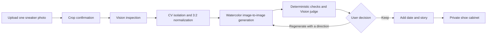
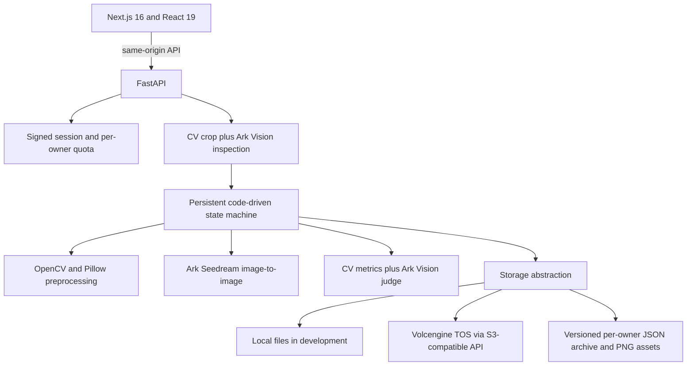

# Shoestory / 鞋历

**Turn a sneaker photo into a hand-painted watercolor illustration, then preserve it with the year and story behind it.**

> Shoes wear out. Stories do not.

[中文说明](README_ZH.md) · [Live Demo](https://sf7d7f90oeokpqnk7mllk.apigateway-cn-beijing.volceapi.com/) · [Product decision record](docs/决策记录-V2-输入与风格.md)


## Overview

Shoestory is a personal memory archive built around sneakers. A user uploads a photo of one shoe, confirms the crop, and receives a consistent watercolor illustration. They can then add a date and story, save it to a private cabinet, revisit it later, edit the record, download the artwork, or delete it.

The product is not a general image generator. Its job is to preserve enough of the original shoe's silhouette, color relationships, logo placement, and recognizable structure while translating different photos into one coherent visual language.

The current public experience is **photo-first and watercolor-only**. Earlier model-search and black-and-white line-art paths remain in the codebase for compatibility and experimentation, but they are not exposed in the current UI.

## Why I Built This

I have liked basketball shoes since middle school and used to draw the pairs I cared about. Many of the shoes I once wore are no longer with me, but each still maps to a particular year, court, or stage of life.

AI made an old idea practical: redraw those shoes in a consistent style and keep the image together with the memory. The product value is therefore not just “generate a nice sneaker image.” It is the combination of **visual reconstruction + personal context + a long-lived archive**.

## Product Experience

### 1. Upload with guidance

Users can choose, drag, or paste an image. Two examples explain the input that produces the most reliable result: one complete shoe, photographed from the side, against a clean background.


### 2. Confirm the subject

The browser resizes the image for transport. The backend corrects orientation, uses CV to suggest a crop, and lets the user adjust it instead of silently guessing which shoe matters.


### 3. Inspect before generating

One vision call checks whether the crop contains a sneaker, whether it shows a single complete side view, and extracts editable hints such as brand, model, colorway, logo visibility, direction, and legible text. Clear non-shoe or unsuitable inputs are stopped with a recovery suggestion; uncertain cases are handled conservatively.


### 4. Generate, judge, and let the user decide

The source is isolated, oriented toe-left, and normalized to a 3:2 canvas before image-to-image generation. A local edge draft gives immediate visual feedback while the model runs. The final artwork is checked by deterministic CV rules and an independent vision judge.

If the first result misses a quality gate, the workflow can retry once with a targeted correction. If a usable image exists but still falls below the automated threshold, it is shown to the user rather than hidden behind a dead end. The user can keep it or regenerate with a specific direction such as color, shape, detail, painterliness, cleanliness, density, or lightness.

### 5. Add the memory and keep it

The recognized model name is editable before archive. Date and story are optional and can be updated later.


The cabinet is ordered as a personal timeline. Each record supports detail view, previous/next navigation, artwork download, editing, and confirmed deletion.

## From Sneaker to Memory



## Product Decisions

| Decision | Evidence and trade-off |
| --- | --- |
| **Photo-first instead of asking for a model name** | The first version searched the web for a reference image. Search results often contained pairs, three-quarter views, or editorial backgrounds. In a recorded comparison, a poor reference scored 0.605 while model-only generation scored 0.829. Asking users for the exact photo they care about made the input more controllable. |
| **An adjustable crop instead of text instructions alone** | Screenshots from shopping apps contain navigation bars, repeated thumbnails, and pricing panels. CV provides a fast default; direct manipulation gives the user final control when the default is wrong. |
| **Watercolor instead of binary line art** | Black-and-white line art forced continuous visual judgments into brittle fill-or-not-fill decisions. Fixes for light shoes could break dark shoes and vice versa. Watercolor keeps color and tonal decisions continuous while still producing a coherent cabinet. |
| **Input quality is guided, not over-policed** | Low resolution and blur produce warnings instead of automatic rejection. The user can still proceed because a watercolor abstraction may remain useful even when the source is imperfect. |
| **Automated quality gates do not replace taste** | Code checks measurable constraints; a vision model evaluates semantic fidelity; the final keep/regenerate decision stays with the user. |
| **Never hide every result behind a failed score** | If generation produced an image, the best candidate is delivered with a restrained note. Only upstream failures with no artwork become hard failures. |
| **Versioned JSON before a database** | The archive is small, private, and normally read as a whole. Versioned JSON in local or object storage is simpler today; the boundary for moving to a database is multi-instance concurrent writes or larger-scale querying. |

## AI & Visual Workflow

### What AI actually does

| Capability | Current implementation |
| --- | --- |
| Photo understanding | A Volcengine Ark vision model receives the cropped image and returns schema-validated JSON: shoe/non-shoe, count, brand, model, colorway, view, completeness, direction, logo visibility, and legible text. Recorded real runs used Doubao Seed 2.1 Pro. |
| Illustration | Volcengine Ark Seedream 5.0 Pro performs image-to-image generation from the normalized user image and a versioned watercolor style template. |
| Independent review | A separate vision call compares source and artwork for silhouette, logo placement, color/style fidelity, and visual noise. Its structured verdict is combined with deterministic checks. |

### What stays deterministic

- EXIF orientation, upload scaling, crop coordinates, subject segmentation, toe-left mirroring, and 3:2 canvas normalization.
- Prompt and style templates, allowed regeneration directions, state transitions, retry limits, call budget, and per-owner data paths.
- Canvas ratio, paper/background checks, subject occupancy, silhouette overlap, persistence, recovery, and access control.
- The quality score ranks candidates; an explicit judge verdict and hard code checks decide whether the workflow retries.

### What this is not

The runtime does **not** use an open-ended Agent Loop, RAG, vector retrieval, long-term AI memory, subagents, MCP, or a skill runtime. It is a fixed, inspectable workflow that calls vision and image-generation capabilities at known steps. A legacy text-model resolver exists for the retired model-name input path, but it is not part of the current public upload flow.

## Quality Strategy

The system deliberately separates three kinds of judgment:

1. **Measurable constraints** — image dimensions, 3:2 ratio, paper/background range, subject occupancy, and source/artwork silhouette overlap are checked in code.
2. **Semantic fidelity** — the vision judge evaluates shoe structure, logo placement, color relationships, watercolor treatment, and unwanted visual noise.
3. **Personal acceptance** — the user decides whether the image belongs in their archive and can request a targeted regeneration.

This split came from a real failure in evaluation design: score distributions were compressed, so severely altered color could still receive a high sub-score while the judge's textual reasoning and final `verdict` correctly identified the failure. The implementation therefore uses scores for ranking and the explicit verdict for pass/fail.

Color fidelity is still the weakest automated boundary. Histogram-based color metrics were too unstable across white, black, and saturated shoes to become a safe hard gate, so color measurements are recorded while semantic judgment and user review remain part of the loop.

## Architecture



Long-running generation runs in a single background worker. Every meaningful state and intermediate artifact is persisted, so a refresh can resume the active task and a process restart marks interrupted work explicitly instead of pretending it completed. The browser stores only the active task ID for recovery; the server remains the source of truth.

Production uses separate Next.js and FastAPI services on veFaaS. The frontend proxies `/api/*` to the backend at build time, while generated images, task records, traces, sessions, and archives live in object storage.

## Validation

Verified against the current repository on **2026-09-29**:

| Check | Result |
| --- | --- |
| Backend test suite | **398 passed** |
| Frontend unit tests | **33 passed** across 3 files |
| Frontend quality gates | ESLint, TypeScript, and production build passed |
| Isolated browser flow | Login, upload, crop, inspection, mock generation, archive, and refresh persistence passed with no console or failed-network errors |
| Real-model evidence | Versioned smoke reports record real Ark inspection, image generation, independent review, archive persistence, and online recovery cases |
| CI | Backend tests plus frontend lint, typecheck, tests, and build run on every push and pull request |

The isolated local flow intentionally uses mock providers, so it validates orchestration and UI rather than model quality. Real image quality is supported separately by the committed smoke reports and the screenshots in this repository, including [the current watercolor run](docs/smoke-report-v2-watercolor-online.md).

## Scope Audit

| Status | Capability |
| --- | --- |
| Implemented and exposed | Photo upload/paste/drag, crop adjustment, inspection, watercolor generation, progress and draft preview, targeted regeneration, archive, persistence, detail view, navigation, download, edit, delete, authentication, and quota enforcement. |
| Implemented but not exposed | Model-name search/generation APIs and the black-and-white line-art style. These support historical records and experiments, not the current product promise. |
| Historical documentation | The V1 PRD describes model-name input and web image search. It is retained as decision history and should not be read as current UI behavior. |
| Roadmap | Stronger deterministic color-fidelity evaluation, broader input angles without breaking cabinet consistency, more validated styles, and a database only when scale or concurrency requires it. |

## Current Limits

- The supported input is one complete sneaker in a clear side view. Top-down, strong perspective, multiple-shoe, or heavily cropped inputs are rejected or sent back for recropping.
- Brand and model recognition can be wrong; the archive title is editable before and after saving.
- Small printed text is unreliable in image generation and follows a “better omitted than invented” rule.
- Illustration and semantic review are probabilistic. One targeted automatic retry is available, but the user remains the final judge.
- Color fidelity does not yet have a trustworthy deterministic hard gate across every colorway.
- The JSON archive assumes a single writer. A multi-instance production topology would require stronger concurrency control or a database.
- Cold starts may add a few seconds because the deployment is optimized for a personal project rather than continuous high traffic.

## Roadmap

- Build a more robust, interpretable color-fidelity evaluator.
- Expand the real-image validation set across shoe shapes, materials, and colorways.
- Explore additional styles only after they can preserve cabinet-level consistency.
- Improve archive storytelling with timeline and collection views without turning the product into a social feed.
- Move archive metadata to a database when concurrent writers or richer queries justify the cost.

## Development Approach

I owned the problem definition, product scope, workflow design, model-capability mapping, prompt and visual strategy, quality boundaries, acceptance criteria, and iteration decisions. AI-assisted coding helped turn those decisions into a working product; it did not replace the product judgment.

The working method was:

`Personal problem → product definition → AI capability split → backend workflow → frontend interaction → automated checks + human acceptance → deployment → iteration from real failures`

The most important artifacts are not the number of AI terms in the architecture, but the recorded decisions: why the input model changed, why the visual style changed, which checks belong in code, which judgments remain probabilistic, and when the user should retain control.

## Run Locally

No model key is required to validate the product flow. Missing Ark configuration automatically selects deterministic mock providers and clearly reports demo mode.

```bash
# Backend — from the repository root
uv venv --python 3.12 .venv
uv pip install --python .venv/bin/python -r backend/requirements.txt
cp .env.example .env
cd backend
../.venv/bin/python -m uvicorn app.main:app --reload --port 8787
```

```bash
# Frontend — in another terminal
cd frontend
npm install
npm run dev
# http://localhost:3000
```

Run the same checks used in CI:

```bash
(cd backend && ../.venv/bin/python -m pytest -q)
(cd frontend && npm run lint && npm run typecheck && npm run test && npm run build)
```

To use real models, provide the Ark API key and the text, vision, and image endpoint identifiers documented in `.env.example`. Secrets are backend-only and excluded from source control and logs.

## Responsible Use

Shoestory is a personal, non-commercial memory and illustration tool. Users should upload images they have the right to use. Brand names and logos shown in examples and generated records remain the property of their respective owners. The repository contains two product-photo examples solely to explain suitable input angles; product screenshots otherwise show generated illustrations.

## License

See [LICENSE](LICENSE).
