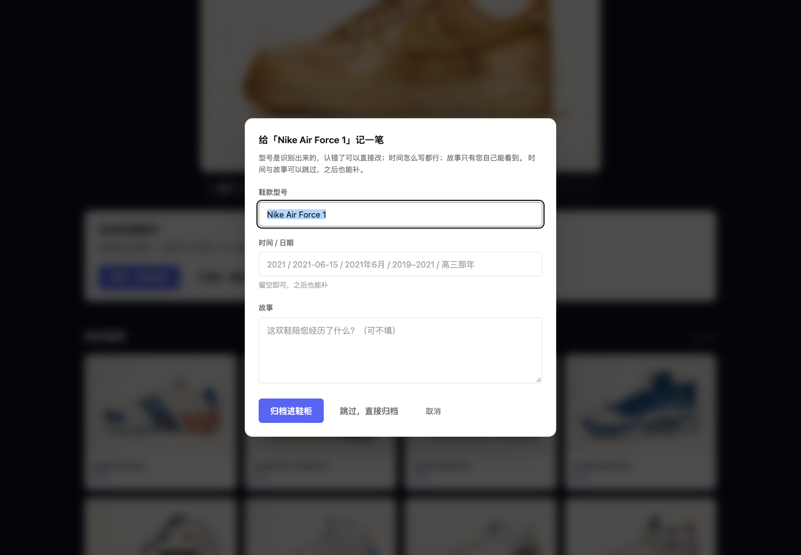
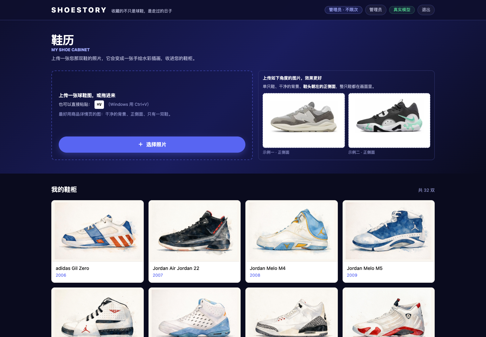

# 鞋历 ShoeStory

**上传一张球鞋照片，它会把鞋画成一张手绘水彩插画，收进你自己的鞋柜。**

> 收藏的不只是球鞋，是走过的日子。


起因很朴素——家里那双穿旧的鞋，想在数字世界里留个样子。但网上搜到的图都不是"我这一双"：角度不对、背景很杂、常常是两只鞋的合影。干脆换个思路：**图由用户自己给，剩下的交给工具**。

---

## 它现在能做什么


**① 上传**　拖拽、粘贴（⌘V）、或者从相册里选一张。旁边放了两张标准角度的示例图——先让人知道"什么样的图能出好效果"。

**② 框选**　自动给出建议框，觉得不准可以拖着改——就像换头像那样。


**③ 认鞋**　一次调用同时判断：这是不是鞋、是不是只有一双、拍摄角度对不对、整只鞋有没有都在画面里、品牌型号、Logo 是什么形状、鞋身上有哪些字。


**④ 画插画**　约 30–60 秒。期间先给一版草稿预览（本机算的，带"草稿预览"角标），正式稿再淡入替换——把"干等"变成"有过程"。

**⑤ 你说了算**　画好之后只有两个选择：满意就收进鞋柜，不满意就再画一张。**不满意时可以选一个方向**（配色不对 / 鞋型不太像 / 细节丢太多 / 太像线稿 / 画面太脏 / 太黑 / 太淡），下一次就重点改那一处。质检在后台照常跑，但不拿来打扰你。

**⑥ 归档**　弹窗里记一笔型号、时间与故事。型号是识别出来的，认错了直接改。



鞋柜是一码一柜：数据存在对象存储里，换设备、刷新页面都在，**别人看不到你的鞋**。



---

## 为什么从"输入型号"改成了"上传照片"

这个产品一开始不是这样的。第一版是**输入型号**，工具自己去网上找这双鞋的图来画。跑了几轮真实测试之后，数据很不客气：

| 做法 | 质检分 | Logo 可辨识 | 说明 |
| --- | --- | --- | --- |
| 用搜到的图当参考 | 0.59–0.69 | 0.18–0.35 | 搜到的多是资讯配图：两只鞋合影、3/4 角度、花背景 |
| 不用参考图、只凭型号画 | 0.80–0.88 | 0.90–0.96 | 反而更好 |

也就是说：**问题不在"画"，在"取材"**。一张角度不对、带背景的参考图，会把结果带得更差——搜索不仅没帮忙，还经常帮倒忙。

于是第二版只做一件事：**请用户自己给一张图**，并把"截错了、拍歪了"这类问题用"可拖拽的框"当场解决。

（完整的证据与取舍记在 [`docs/决策记录-V2-输入与风格.md`](docs/决策记录-V2-输入与风格.md)。）

---

## 一次失败的复盘：当风格逼着模型去做"二值决策"

这条踩坑值得单独说，因为它最后导致**整个主风格被换掉**。

最初的主风格是**黑白线稿**：纯黑白的线条画，Logo 用实心黑块填上。看起来简单，但里面藏着一个要命的设计：**"这块要不要填黑"是一个非黑即白的选择**。

而模型是靠**照片里的颜色对比**来判断的。于是同一个品牌，白鞋上的深色 Logo 它填了，黑鞋上的黑色 Logo 它就不填——它看不出那是个"标记"。同一批测试里，同一款鞋因为配色不同，结果一个实心一个空心。

接下来是三轮修修补补：

1. 加一张"品牌标志知识表"，让**代码**而不是模型来决定必须填——好了一些；
2. 但提示词里我举了个例子（"深色鞋头盖"），模型把它当成了模板，**每双鞋的鞋头都凭空多出一块黑**；
3. 把例子删掉、把"黑色占比"这种凑数目标也删掉——这批鞋好了，可另一批（浅色鞋）又变得太轻。

**每修好一类，就坏掉另一类。** 复盘时才想明白：问题不在规则写得对不对，而在**我把一个连续的判断硬塞进了一个二值的框架里**——纯黑白没有中间地带，任何一点犹豫都只能表现为"整体崩"。

所以后来换了**手绘水彩**：颜色是连续的，模型不需要在"填/不填"之间做选择，同色系的鞋、深浅不同的鞋都天然成立。同一批鞋重跑，**14 张全部一次成型**——包括黑白线稿里怎么调都画不好的那几双（白底白标的 Stan Smith、白鞋面配白底的 PG4、纯线描的 Melo 5.5）。

这一段留下的教训写进了代码注释：**如果一个判断连人都觉得"看情况"，就别指望模型给稳定答案，更别把它设成硬门槛。**

---

## 另一件事：质检分的"虚高"，和 `verdict`

换到水彩之后，我给质检加了一组反向对照——**故意把画稿改坏，看质检能不能发现**：

| 输入 | 鞋型分 | 风格分 | 判官结论 |
| --- | --- | --- | --- |
| 正常水彩 | 0.96 | 0.94 | pass |
| 把色相整体旋转 160°（配色完全错了） | 0.96 | 0.90 | **fail** |
| 把饱和度压到 12%（褪成灰） | 0.96 | 0.90 | **fail** |
| 换成黑白线稿 | 0.58 | 0.02 | **fail** |

发现问题了：**逐项分数是压缩的**——配色全错，风格分也只从 0.94 掉到 0.90，加权总分仍高于阈值。真正分开的，是判官自己那个 `verdict` 字段，而且它还能准确说出"原鞋是白／红／深藏青，插画改成了亮绿、蓝绿与橄榄绿"。

于是判定逻辑改成：**分数用来排序，`verdict` 用来定成败**。

顺带说一句更早的教训：在这之前，我一度很依赖判官给的分——直到它给一张"Logo 没填"的画稿打了满分（它的提示词里有一条"原图看不到标识就按满分处理"的宽容条款，被过度套用了）。**能用量化指标判断的事，不要交给模型说"我觉得合格"。**

---

## 几个想清楚才敢做的取舍

| 取舍 | 为什么 |
| --- | --- |
| **用固定流程 + 代码状态机，不让模型自由发挥** | 这个产品的流程是确定的（识别→画→检→归档），没有需要模型"自己想"的环节。让它自由选工具只会带来不可控的开销和结果 |
| **质检判定交给代码——但只限能量化的部分** | 画布是不是 3:2、背景留白够不够、轮廓和原鞋重不重合，这些能用代码算的就该用代码；主观的"像不像水彩"交给独立判官，并且把它的结论（而不是它的分数）当判据 |
| **输入规范用"提示"而不是"拦截"** | 一开始我设了"图片短边不够就拒收"——结果一张从手机截图里裁出来、画面明明很清楚的小图根本传不上去，界面上还没有任何反应。现在改成：尺寸不当门槛，只评估清晰度，糊了就提醒一句"换一张会更清楚"，**画不画仍然由用户定** |
| **不用数据库，用带版本号的 JSON** | 单用户、数据量小（几十到几百条）、只需要"全量读 + 排序"。什么时候该换数据库也写清楚了 |
| **质检信息不给用户看** | 用户要判断的是"这张我满不满意"，不是"鞋带实心度 0.38"。明细留在后台，出问题能查 |
| **图形化描述尽量不做，能把话说清的就不堆术语** | ⬅ 这条是产品原则：能给用户一句人话，就不给他一个指标 |

---

## 它现在到什么程度

真实跑过的数据（都被记录下来，不是估计）：

| 项 | 实测 |
| --- | --- |
| 出图时间 | **30–60 秒**（等待期间先给草稿预览，避免干等） |
| 一次成型率 | 换水彩之后，**14 张真图全部一次通过** |
| 质检（阈值 0.82） | 0.947–0.9675；反向对照（人为改坏）全部被 `verdict` 拦下 |
| 自动化测试 | 后端 **398** 项 + 前端 33 项，另有 lint / 类型检查 / 生产构建；**CI 在每次推送与每个 PR 上把这两套都跑一遍**（见 `.github/workflows/test.yml`） |
| 中间产物 | 每次生成的原图、画布、骨架、模型原始返回、交付稿、逐项质检、上游调用次数，全部留档 |

更多细节在 [`docs/`](docs/)：转向的决策记录、上线记录（含上线后发现的真实问题与修复），以及三份真图实测报告。

---

## 本地跑起来（不需要任何 API Key）

```bash
# 1) 后端：装依赖、起服务（不填 Key 也能跑，会自动进入演示模式）
uv venv --python 3.12 .venv
uv pip install --python .venv/bin/python -r backend/requirements.txt
cp .env.example .env
cd backend && python -m uvicorn app.main:app --reload --port 8787

# 2) 前端（另开一个终端）
cd frontend && npm install && npm run dev     # http://localhost:3000
```

演示模式下出图是占位画稿，但**流程与线上完全一致**（同样的状态机、同样的质检、同样的存储层），只把模型换成了本地 mock。想接真实模型，在 `.env` 里填火山方舟的 Key 就行。

---

## 还不完善的地方

- **配色保真度没法自动判定。** 我试过用"色相直方图重合度"来做，实测没有区分度——原鞋本身没颜色时（比如一双纯黑鞋）这个指标就是噪声，即使有颜色，同一批正确产出的取值也散得很开。所以配色这件事目前只能靠判官，而判官是有波动的。**这是这个项目当前最明显的一处弱点。**
- **只支持正侧面的单只鞋。** 俯视、斜侧角、一张图里好几只鞋，画出来没法保证和实物一致、也破坏鞋柜的整齐，所以会被挡下来并说清怎么改。
- **型号可能认错**：视觉模型也有看走眼的时候，归档标题可以自己改。
- **鞋身小字**走"宁缺勿错"，认不出来就不写。
- **没有导出功能**：这版先不做。
- **冷启动**：为了控制开销只开一个实例，久不访问后第一次打开会慢几秒（有自预热兜底）。

---

## 关于这个项目

名字取"鞋"和"历"：一双鞋，一段经历。英文名 ShoeStory。

技术上是 **FastAPI + Next.js**，模型用**火山方舟**（文本 / 视觉 / 图生图），部署在**火山引擎函数服务**上，画稿与档案存**对象存储**。

> 说明：这是个人纪念性质的再创作工具，示例与截图中的品牌名称与 Logo 均归原品牌所有。
> 仓库里有两张真实商品照片 —— 就是界面上那两张"推荐上传角度"的示例（用来说清"什么样的图能画好"），
> 除此之外不含任何真实品牌商品图；截图里的插画都是模型基于用户自己上传的照片生成的。

做这个项目的过程里，我留下两类东西：一是**决策记录**——为什么从"输入型号"改成"上传照片"、为什么换掉主风格，都带着当时的真实数据；二是**可复现的评测台**——同一批鞋、同一组指标，改前改后各跑一次对比。上面那两个复盘里的数字，都是从它跑出来的。
