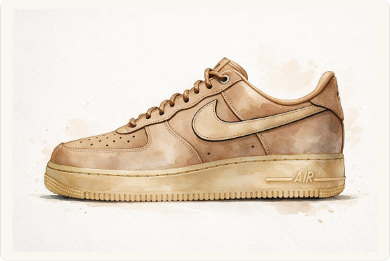
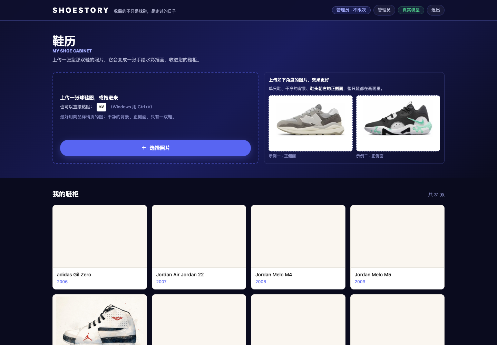
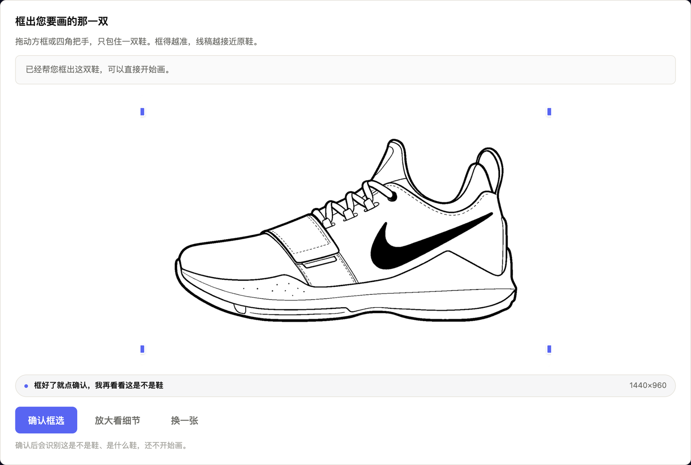
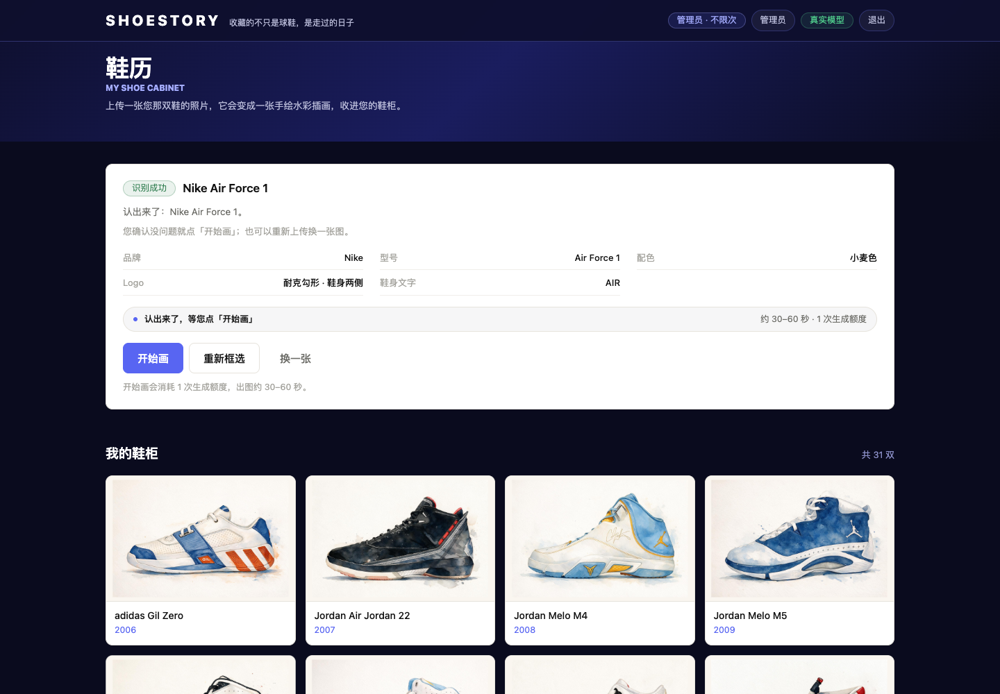
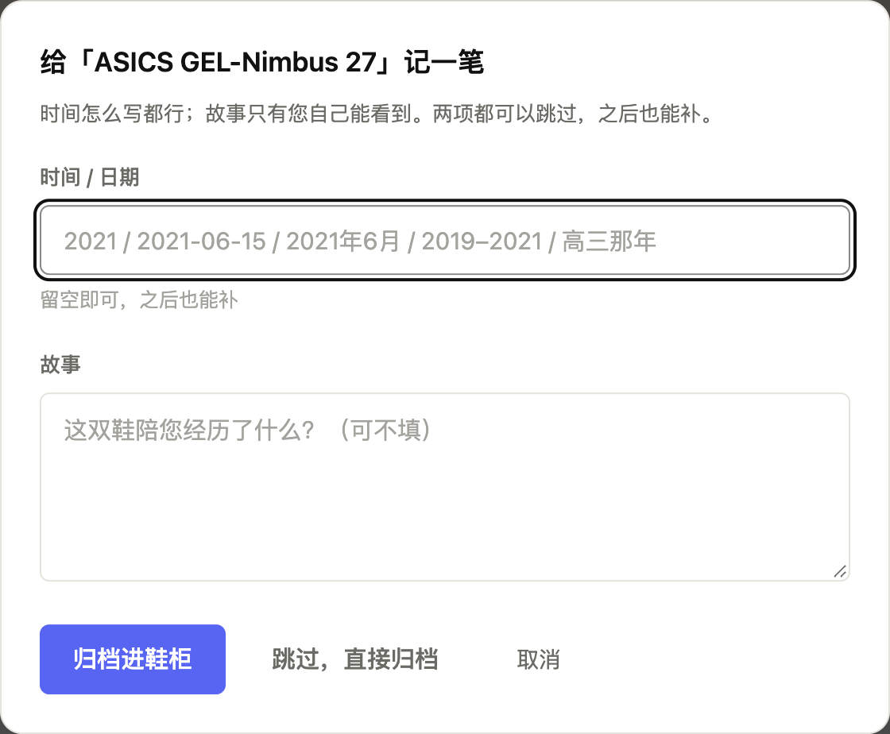

# 鞋历

**把一双鞋，变成一张黑白线稿，收进自己的鞋柜。**

> 收藏的不只是球鞋，是走过的日子。



这是我做的一个小工具：**上传一张球鞋照片，它会认出这是哪双鞋，把它画成一张干净的黑白线稿，存进你自己的鞋柜。**

起因很朴素——家里那双穿旧的鞋，想在数字世界里留个样子。但网上搜到的图都不是"我这一双"：角度不对、背景很杂、常常是两只鞋的合影。干脆换个思路：图由用户自己给，剩下的交给工具。

---

## 它现在能做什么



**① 上传**　拖拽、粘贴（⌘V）、或者从相册里选一张。建议用商品详情页那种白底、正侧面的图。

**② 框选**　自动给出建议框，觉得不准可以拖着改——就像换头像那样。



**③ 认鞋**　一次调用同时判断：这是不是鞋、是不是只有一双、品牌型号、Logo 是什么形状、鞋身上有哪些字。



**④ 画线稿**　约 30–60 秒。识别到的 Logo 会用实心黑块填上；鞋身文字"宁缺勿错"——认不出来宁可不写，写错反而伤纪念感。

**⑤ 你说了算**　画好之后只有两个选择：满意就收进鞋柜，不满意就再画一张。质检在后台照常跑，但不拿来打扰你。


**⑥ 归档**　记一笔时间和故事，之后随时能翻。



鞋柜是一码一柜：数据存在对象存储里，换设备、刷新页面都在，别人看不到你的鞋。

---

## 为什么从"输入型号"改成了"上传照片"

这个产品一开始不是这样的。第一版是**输入型号**，工具自己去网上找这双鞋的图来画。跑了几轮真实测试之后，数据很不客气：

| 做法 | 质检分 | Logo 可辨识 | 说明 |
| --- | --- | --- | --- |
| 用搜到的图当参考 | 0.59–0.69 | 0.18–0.35 | 搜到的多是资讯配图：两只鞋合影、3/4 角度、花背景 |
| 不用参考图、只凭型号画 | 0.80–0.88 | 0.90–0.96 | 反而更好 |

也就是说：**问题不在"画"，在"取材"**。一张角度不对、带背景的参考图，会把结果带得更差——搜索不仅没帮忙，还经常帮倒忙。

于是第二版只做一件事：**请用户自己给一张图**。产品文案也顺着改了——引导用户用商品详情页的原图（白底、正侧面、只有一双），并在上传后给一个可拖拽的框，让"截错了、拍歪了"这类问题当场解决。

（完整的证据与取舍记在 [`docs/决策记录-V2-输入与风格.md`](docs/决策记录-V2-输入与风格.md)。）

---

## 一次失败的复盘：照片里看不见的 Logo，被我的规则判了错

有张 Air Jordan 36 的商品图，拍照角度看不到飞人标志。模型很老实：那个位置画了个装饰符号。而我的质检规则写着"品牌 Logo 必须实心填色"——于是判定不合格，自动重画一次还是不合格，最后直接告诉用户"这次没画好"。

用户连图都没看到，钱已经花了。

复盘下来是两件事：

1. **规则没考虑"照片里本来就看不清"这种情况。** 现在 Logo 只按照片里**看得见的**来判断：看得见就要求画准、画实；看不见就不要求，同时明确禁止模型凭空编一个 Logo。
2. **失败不该是个死胡同。** 现在质检分成两类：
   - 能确定性判断的（画布比例、纯二值、白底、有没有排线、有没有整块涂黑）→ 继续当门槛，不过就自动重画一次；
   - 主观判断的（Logo 清晰度、鞋带实心度、文字可辨度）→ 只用来决定"要不要再画一张"，**不再拦着不交付**。

不管哪种情况，只要画出来了，就一定交给用户自己判断。

同一张图重跑：**一次通过，0.899 分。** 另一张浅棕色的空军一号两次通过，0.9655 分。

---

## 几个想清楚才敢做的取舍

| 取舍 | 为什么 |
| --- | --- |
| **用固定流程 + 代码状态机，不让模型自由发挥** | 这个产品的流程是确定的（识别→画→检→归档），没有需要模型"自己想"的环节。让它自由选工具只会带来不可控的开销和结果 |
| **质检判定交给代码，模型只负责打分** | 画布是不是 3:2、是不是纯黑白、线条有没有跑偏，这些能用代码量化的就不该让模型"自己说自己合格" |
| **不用数据库，用带版本号的 JSON** | 单用户、数据量小（几十到几百条）、只需要"全量读 + 排序"。什么时候该换数据库也写清楚了 |
| **质检信息不给用户看** | 用户要判断的是"这张我满不满意"，不是"鞋带实心度 0.38"。明细留在后台，出问题能查 |
| **图形化描述尽量不做，能把话说清的就不堆术语** | ⬅ 这条是产品原则：能给用户一句人话，就不给他一个指标 |

---

## 它现在到什么程度

真实跑过的数据（都被记录下来，不是估计）：

| 项 | 实测 |
| --- | --- |
| 出图时间 | **30–60 秒**（等待期间会先给一版草稿预览，避免干等） |
| 质检分（阈值 0.80） | **0.899 / 0.927 / 0.9445 / 0.9655**（四张真图） |
| 一次通过 | 四张里三张一次通过，第四张自动重画一次后通过 |
| 自动化测试 | 后端 310 项、前端 33 项，另有类型检查与 lint；CI 会跑全套 |

细节可以看 [`docs/阶段5上线记录-V2.md`](docs/阶段5上线记录-V2.md) 和三份原始报告 [`docs/smoke-report-v2-upload.md`](docs/smoke-report-v2-upload.md)、[`-AJ36`](docs/smoke-report-v2-AJ36.md)、[`-AF1`](docs/smoke-report-v2-AF1.md)。

---

## 本地跑起来（不需要任何 API Key）

```bash
# 1) 后端：装依赖、起服务（不填 Key 也能跑，会自动进入演示模式）
uv venv --python 3.12 .venv
uv pip install --python .venv/bin/python -r backend/requirements.txt
cp .env.example .env
cd backend && python -m uvicorn app.main:app --reload --port 8787

# 2) 前端（另开一个终端）
cd frontend && npm install && npm run dev     # http://localhost:3000
```

演示模式下出图是占位画稿，但**流程与线上完全一致**（同样的状态机、同样的质检、同样的存储层），只把模型换成了本地 mock。想接真实模型，在 `.env` 里填火山方舟的 Key 就行。

---

## 还不完善的地方

- **型号可能认错**：视觉模型也有看走眼的时候，归档标题可以自己改。
- **浅色界面 / 特别长的截图**：自动框有时要给一点帮助，手动收一下框。
- **低对比配色**（比如浅棕、纯白）偶尔需要画第二次。
- **鞋身小字**走"宁缺勿错"，认不出来就不写。
- **没有导出功能**：这版先不做，所以"导出时合成牛皮纸底"也跟着没做。
- 冷启动：为了控制开销只开一个实例，久不访问后第一次打开会慢几秒。

---

## 关于这个项目

名字取"鞋"和"历"：一双鞋，一段经历。

技术上是 **FastAPI + Next.js**，模型用**火山方舟**（文本 / 视觉 / 图生图），部署在**火山引擎函数服务**上，画稿与档案存**对象存储**。项目过程中我做决策笔记，踩到的坑也记下来——像上面那个 Logo 规则的事，都留在 `docs/` 里。
