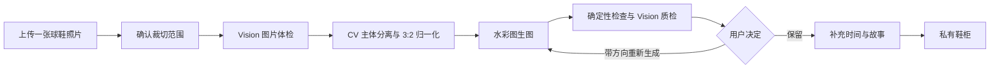
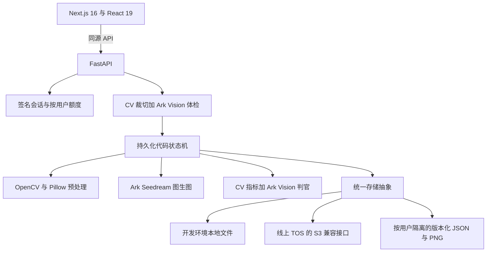

# Shoestory / 鞋历

**上传一张球鞋照片，把它变成一张手绘水彩插画，再连同年份与故事一起保存。**

> 鞋会穿旧，故事不会。

[English](README.md) · [在线体验](https://sf7d7f90oeokpqnk7mllk.apigateway-cn-beijing.volceapi.com/) · [产品决策记录](docs/决策记录-V2-输入与风格.md)


## Overview｜项目概览

鞋历是一个围绕球鞋建立的个人记忆档案。用户上传一只鞋的照片、确认裁切范围，系统把它转化为统一风格的水彩插画；随后可以补充时间与故事，保存进自己的鞋柜，并在之后查看、下载画稿、修改档案或删除记录。

它不是一个通用 AI 绘图器。产品真正要解决的是：在保留原鞋轮廓、配色关系、Logo 位置和关键结构的前提下，把不同来源的照片转译成同一套视觉语言，最终形成可以长期积累的个人档案。

当前公开产品是**上传照片优先、只开放水彩风格**。早期的“输入型号后搜图”和黑白线稿链路仍保留在代码中，用于兼容旧档案与继续实验，但没有出现在当前首页。

## Why I Built This｜为什么做鞋历

我从中学开始喜欢篮球鞋，以前也会自己画喜欢的鞋。后来很多真正穿过的鞋已经不在身边，但它们仍然对应着不同的年份、球场和人生阶段。

AI 让一个放了很久的想法变得可行：把那些鞋重新画下来，并把画面与当时的记忆放在一起。因此，鞋历的价值不只是“生成一张好看的球鞋图”，而是把**视觉记录、个人语境和长期归档**组合成一个完整产品。

## Product Experience｜当前产品体验

### 1. 上传前先把好输入说清楚

用户可以选择、拖拽或粘贴图片。页面用两张示例说明更稳定的输入：单只、完整、正侧面、背景干净。


### 2. 自动建议，但由用户确认主体

浏览器先缩放图片用于传输；后端处理 EXIF 朝向，通过 CV 给出建议框。用户可以直接调整，而不是让系统在多鞋或商品页截图中悄悄猜错主体。


### 3. 生成之前先体检

一次 Vision 调用同时判断：是不是运动鞋、是否只有一只、是否完整、是不是正侧面，并提取品牌、型号、配色、Logo 可见程度、鞋头方向和可辨认文字等结构化信息。明确不适合的输入会被拦下并给出恢复建议；不确定时则采取更克制的处理。


### 4. 生成、质检，再把决定权交还用户

系统先完成主体分离、鞋头朝左统一和 3:2 画布归一化，再进行图生图。等待期间，本地 CV 生成的边缘草稿先提供可见反馈；正式画稿完成后，再经过确定性 CV 指标和独立 Vision 判官两层检查。

如果第一张没有通过质量门槛，系统最多自动定向重画一次。如果已有可用画稿但仍未完全达标，产品不会把结果藏在失败页后面，而是展示最优稿，让用户决定保留还是重新生成。重新生成时可以指定配色、鞋型、细节、水彩感、干净程度、明暗或画面密度等具体方向。

### 5. 画稿只是入口，档案才是结果

归档前可以修改识别到的型号；时间和故事均可跳过，也可以之后再补。


鞋柜按照个人时间线组织。每条记录支持查看详情、上一双/下一双、下载画稿、编辑信息和二次确认删除。

## From Sneaker to Memory｜从球鞋到记忆



## Product Decisions｜关键产品判断

| 决策 | 证据与取舍 |
| --- | --- |
| **从输入型号改为上传照片** | 第一版先根据型号从公开网页搜参考图，但搜索结果经常是双鞋合影、斜侧角度或资讯背景。一次有记录的对比中，坏参考图路径得分 0.605，不用参考图的型号直出为 0.829。让用户提供“自己在意的那张图”，输入反而更可控。 |
| **裁切框可调整，而不是只给文字说明** | 球鞋 App 截图里常有导航栏、重复缩略图和价格区域。CV 负责提供低成本默认值；当默认值不准时，用户可以直接拖动修正。 |
| **从黑白线稿转向水彩** | 黑白二值风格会把连续的视觉判断强行变成“填或不填”。为浅色鞋修规则可能破坏深色鞋，反之亦然。水彩保留连续色调，同时仍能形成统一鞋柜。 |
| **输入质量以提示为主，不轻易拒绝** | 尺寸偏小或模糊只给提醒，不作为硬门槛。水彩本身有抽象空间，是否继续应该由用户决定。 |
| **自动质检不能替代人的审美判断** | 能量化的交给代码，语义保真交给 Vision，最终“这张是不是我想留下的”交给用户。 |
| **有图就不制造死路** | 只要已经生成画稿，就展示最优结果并给克制提示；只有上游失败、完全没有画稿时才进入硬失败。 |
| **暂时使用带版本号的 JSON，而不是先上数据库** | 当前是小规模私有档案，通常整表读取。local/TOS 上的版本化 JSON 足够简单；当出现多实例并发写或复杂查询需求时，再迁移数据库。 |

## AI & Visual Workflow｜AI 与视觉工作流

### AI 真正负责什么

| 能力 | 当前实现 |
| --- | --- |
| 图片理解 | 火山方舟 Vision 模型读取裁切图，输出经过 Schema 校验的 JSON：鞋/非鞋、数量、品牌、型号、配色、视角、完整性、朝向、Logo 可见程度和可辨文字。已记录的真实运行使用 Doubao Seed 2.1 Pro。 |
| 插画生成 | 火山方舟 Seedream 5.0 Pro 读取归一化后的用户图片，并结合版本化水彩风格模板完成图生图。 |
| 独立质检 | 另一轮 Vision 调用对比原图与画稿，检查鞋型、Logo 位置、配色/风格保真和画面噪点，再与确定性指标共同决定是否重试。 |

### 哪些必须由确定性代码控制

- EXIF 朝向、上传缩放、裁切坐标、主体分离、鞋头朝左、3:2 画布归一化。
- Prompt / Style 模板、可选重画方向、状态迁移、重试上限、调用预算和按用户隔离的数据路径。
- 画布比例、纸张背景、主体占比、轮廓重合、持久化、恢复与权限控制。
- 质量分数用于排序；明确的判官 `verdict` 与代码硬检查用于决定是否重试。

### 这不是一个什么系统

当前运行时没有开放式 Agent Loop、RAG、向量检索、AI 长期记忆、Subagent、MCP 或 Skill runtime。它是一条步骤固定、可以检查和回放的工作流，只在明确节点调用 Vision 与图像生成能力。旧的“输入型号”链路保留了文本模型校对器，但它不属于当前公开上传流程。

## Quality Strategy｜质量策略

系统刻意把质量判断分成三层：

1. **可以测量的约束**：尺寸、3:2 比例、纸张背景区间、主体占比、原图与画稿轮廓重合度由代码判断。
2. **语义保真**：Vision 判官判断鞋型结构、Logo 位置、配色关系、水彩质感和多余元素。
3. **个人接受度**：用户决定这张图是否值得进入自己的鞋柜，并可以选择具体方向重新生成。

这种拆分来自一次真实的评测失效：部分分项分数过度压缩，即使人为把配色改坏，分数仍可能偏高；但同一判官的文字理由和最终 `verdict` 能准确指出问题。因此当前实现用分数排序，用明确结论决定成败。

配色保真仍是最弱的自动化边界。色相直方图等指标在白鞋、黑鞋和高饱和鞋之间波动太大，无法安全地作为统一硬门槛；系统会记录颜色指标，但仍保留语义质检与用户确认。

## Architecture｜系统架构



长任务由单个后台 worker 串行执行。关键状态和中间产物持续落盘，因此页面刷新后可以找回正在执行的任务；进程重启时，未完成任务会被明确标记为 interrupted，而不是假装完成。浏览器只在 localStorage 保存当前任务 ID 用于恢复，服务端数据才是事实来源。

线上前后端分别部署在 veFaaS。Next.js 在构建时固化后端代理地址；任务记录、轨迹、会话、画稿和鞋柜档案存入对象存储。

## Validation｜验证结果

基于当前仓库在 **2026-09-29** 重新验证：

| 检查 | 结果 |
| --- | --- |
| 后端测试 | **398 项通过** |
| 前端单元测试 | 3 个文件、**33 项通过** |
| 前端质量门槛 | ESLint、TypeScript、生产构建全部通过 |
| 隔离浏览器闭环 | 登录、上传、裁切、体检、mock 生成、归档、刷新后持久化全部通过；无 Console 错误与异常失败请求 |
| 真实模型证据 | 仓库内的版本化冒烟报告记录了真实 Ark 体检、图像生成、独立质检、归档持久化和线上问题修复 |
| CI | 每次 push 与 PR 都运行后端测试，以及前端 lint、typecheck、test、build |

隔离的本地闭环刻意使用 mock provider，因此它验证的是编排和 UI，不冒充真实模型质量。真实出图质量由已提交的冒烟报告和产品截图独立证明，包括[当前水彩链路报告](docs/smoke-report-v2-watercolor-online.md)。

## Scope Audit｜能力边界

| 状态 | 能力 |
| --- | --- |
| 已实现且当前开放 | 上传/粘贴/拖拽、裁切调整、图片体检、水彩生成、进度与草稿预览、定向重画、归档、持久化、详情、前后翻页、下载、编辑、删除、鉴权与额度控制。 |
| 已实现但未开放 | 输入型号后搜图/生成的 API、黑白线稿风格。它们用于旧档案兼容与实验，不属于当前产品承诺。 |
| 历史文档 | V1 PRD 描述的是“输入型号 + 网页搜图”。它作为产品决策历史保留，不代表当前首页能力。 |
| Roadmap | 更可靠的确定性配色评估；在不破坏鞋柜一致性的前提下支持更多角度；更多经过验证的风格；只有规模或并发真正需要时才引入数据库。 |

## Current Limits｜当前限制

- 当前只支持单只、完整、清晰的正侧面球鞋。俯视、明显透视、多只鞋或严重裁缺会被拒绝，或要求重新框选。
- 品牌和型号识别可能出错；归档标题在保存前后都可以修改。
- 图像模型对鞋身小字不稳定，产品采用“宁缺勿错”的原则。
- 插画生成和语义质检具有概率性。系统最多自动定向重试一次，但最终判断仍由用户完成。
- 暂时没有一个能跨所有配色可靠工作的确定性颜色硬门槛。
- JSON 档案按照单写者设计；如果未来启用多实例并发写，需要更强的并发控制或数据库。
- 当前部署面向个人项目并优先控制成本，长时间无人访问后的首次打开可能多等待几秒。

## Roadmap｜下一步

- 设计更稳健、可解释的配色保真评估。
- 扩充真实图片验证集，覆盖更多鞋型、材质和配色。
- 只有在风格能保持鞋柜级一致性后，才开放更多视觉风格。
- 增强时间线和收藏视图，但不把个人档案做成社交信息流。
- 当并发写入或复杂查询真正出现时，把档案元数据迁移到数据库。

## Development Approach｜开发方法

我负责问题定义、产品范围、Workflow、AI 能力拆分、Prompt 与视觉策略、质量边界、验收标准和迭代判断。AI Coding 用来帮助这些决策落成产品，但不替代产品判断。

实际方法是：

`真实个人问题 → 产品定义 → AI 能力拆解 → 后端工作流 → 前端交互 → 自动检查 + 人工验收 → 部署 → 根据真实失败继续迭代`

这个项目最有价值的证据不是用了多少 AI 名词，而是留下了可以回看的判断：为什么改变输入方式，为什么更换视觉风格，哪些检查应该写进代码，哪些判断仍然有概率性，以及何时应该把控制权交回用户。

## Run Locally｜本地运行

验证产品流程不需要模型 Key。Ark 配置缺失时会自动进入明确标注的演示模式，用确定性 mock provider 代替真实上游。

```bash
# 后端：从仓库根目录执行
uv venv --python 3.12 .venv
uv pip install --python .venv/bin/python -r backend/requirements.txt
cp .env.example .env
cd backend
../.venv/bin/python -m uvicorn app.main:app --reload --port 8787
```

```bash
# 前端：另开一个终端
cd frontend
npm install
npm run dev
# http://localhost:3000
```

运行与 CI 一致的检查：

```bash
(cd backend && ../.venv/bin/python -m pytest -q)
(cd frontend && npm run lint && npm run typecheck && npm run test && npm run build)
```

如需接入真实模型，请按照 `.env.example` 配置 Ark API Key，以及文本、Vision 和图像生成 Endpoint。密钥只由后端读取，并从版本控制与日志中排除。

## Responsible Use｜使用边界

鞋历是个人、非商业性质的记忆与插画工具。用户应只上传自己有权使用的图片。示例和生成档案中出现的品牌名称与 Logo 归各自权利人所有。仓库中的两张商品图只用于说明合适的上传角度；其他产品截图展示的是生成插画。

## License

见 [LICENSE](LICENSE)。
